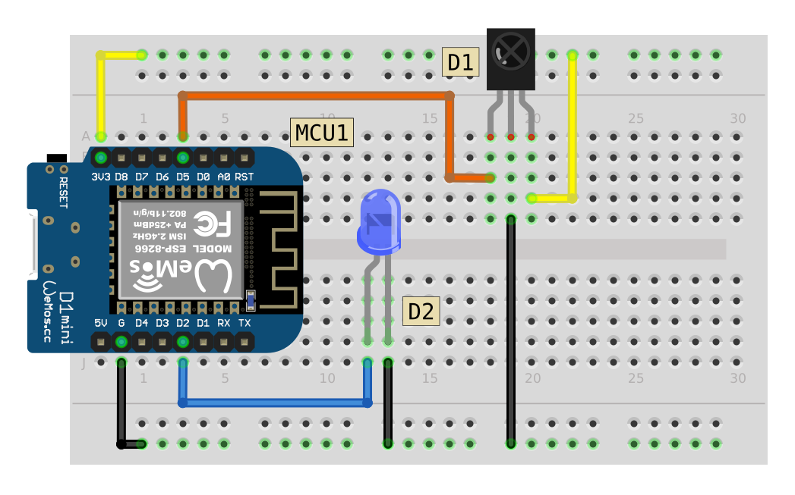

# IR Receive

## Breadboard Circuit

## Component List

|Code|Description|
|:--|:--|
|MCU1|Wemos D1 Mini|
|D1|TL1838 IR Receiver|
|D2|LED|

## Libraries Used

1. [IRremoteESP8266](https://github.com/crankyoldgit/IRremoteESP8266)
